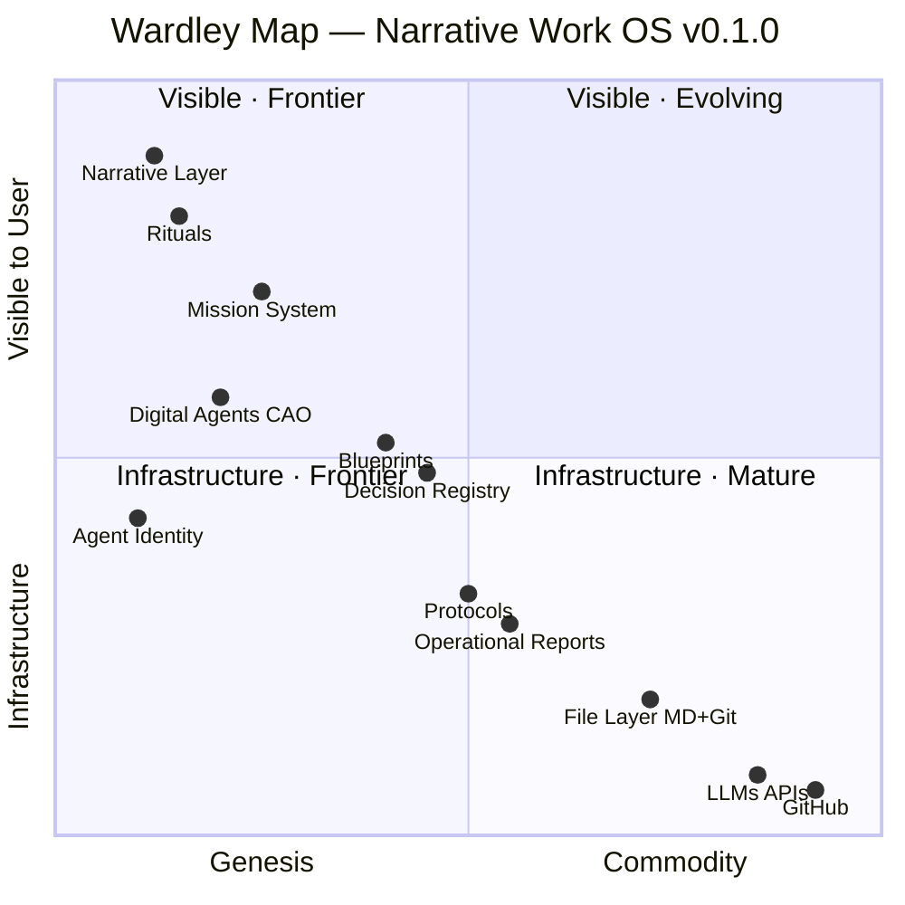

# Wardley Map — Narrative Work OS

> **Summary:** System blueprint: current state, target, gaps and dependencies.
> **Epistemic:** The real state vs. the target — where we are and where we are going.
> **Pragmatic:** Identify which missions close the documented gaps.
> **Audience:** Agents · Oracles

---


> A Wardley Map shows two things: **how visible** a component is to the user (Y axis) and **how evolved** it is in the market (X axis: Genesis → Custom → Product → Commodity).
> 
> Strategic insight comes from the gaps: components stuck in Genesis that should be Product, components heading to Commodity faster than the business realizes.

---

## Axes (per /wardley)

A strategic map of the Narrative Work OS. Two axes tell the full story: **how visible** each component is to the user, and **how evolved** it is in the market.

- **Y axis — Visibility:** From infrastructure (invisible to users) to visible (what users interact with directly).
- **X axis — Evolution:** From Genesis (novel, unstable) → Custom → Product → Commodity (standardized, available everywhere).

---

## Map (Mermaid)



---

## Components — Full Analysis

### 🎭 Frontier (Genesis) — High Visibility

| Component | Position | Strategic note |
|---|---|---|
| **Narrative Layer** | Genesis · Max visible | Highest differentiator. Highest adoption risk. External users may reject before seeing value. |
| **Rituals** | Genesis · Very visible | Daily, Dark Council, Lunar Coven. Unique engagement mechanism. Auto-selects cultural fit. |
| **Mission System** | Genesis→Custom · Visible | Core differentiator. Epistemic + pragmatic value per mission is nowhere else. Moat here. |

### 🤖 Frontier (Genesis) — Mid Visibility

| Component | Position | Strategic note |
|---|---|---|
| **Digital Agents (CAO)** | Genesis · Mid visible | Technology (LLMs) is commodity. Application layer (SOUL.md, OPERATOR.md, persistent identity) is custom. |
| **Agent Identity** | Genesis · Mid | khepri@, operational laws, persistent memory. No competitor has this today. |

### 🏗️ Custom — Mid Visibility

| Component | Position | Strategic note |
|---|---|---|
| **Blueprints** | Custom · Mid | Similar to C4 model or arc42, but with delta tables and semaphore. Converging to product. |
| **Decision Registry** | Custom · Mid | ADRs exist elsewhere. Narrative integration is custom. Append-only principle is differentiator. |

### 📄 Custom → Product — Low Visibility

| Component | Position | Strategic note |
|---|---|---|
| **Protocols** | Custom · Low-mid | SOPs + AI-readable format. Converging toward product. |
| **Operational Reports** | Custom · Low | Git-native, append-only. Simple but unique in format and agent-readability. |
| **File Layer (MD+Git)** | Product · Low | Commodity for devs. Custom for organizations. Crossing the chasm here is the adoption challenge. |

### ⚙️ Commodity — Infrastructure

| Component | Position | Strategic note |
|---|---|---|
| **LLMs APIs** | Commodity · Infrastructure | Anthropic, Ollama. Replaceable. No moat. Cost optimization target. |
| **GitHub** | Commodity · Infrastructure | Replaceable by any git host. No strategic dependency. |

---

## Component Detail (per /wardley)

Full per-component analysis as published on the /wardley page: what it does, its strategic tension, and its moat. Coordinates are the page's (x, y) values on a 0–100 scale (x = evolution, y = distance from top / visibility); they differ by ±1 point from the Mermaid map above for some components — both are kept, the page values marked here (per /wardley).

### Narrative Layer

- **Evolution:** Genesis · **Visibility:** Max visible · **Layer:** frontier · **Position:** (12, 10) *(per /wardley)*
- **What it does:** The optional skin that makes the system feel alive. Guilds, lore, rituals. The highest differentiator — and the highest adoption risk.
- **Strategic tension:** Users hit this first. They may reject before reaching the real value. That's why it's Layer 4, not Layer 0.
- **Moat:** High — nowhere else has this

### Rituals

- **Evolution:** Genesis · **Visibility:** Very visible · **Layer:** frontier · **Position:** (16, 18) *(per /wardley)*
- **What it does:** Daily standups, Dark Council (weekly strategy), Lunar Coven (creativity). Structured ceremonies with operational weight.
- **Strategic tension:** High engagement, high churn risk if vocabulary isn't adopted. Must be optional to start.
- **Moat:** High — cultural adoption is a two-way commitment

### Mission System

- **Evolution:** Genesis → Custom · **Visibility:** Visible · **Layer:** differentiator · **Position:** (26, 28) *(per /wardley)*
- **What it does:** Every unit of work is a structured document: story, acceptance criteria, epistemic value, pragmatic value, and execution reality. Missions leave knowledge, not just checkmarks.
- **Strategic tension:** This is the real moat. Not the lore. The window to establish it as a standard is 18–24 months.
- **Moat:** Very high — this design exists nowhere else

### Digital Agents (CAO)

- **Evolution:** Genesis → Custom · **Visibility:** Mid visible · **Layer:** differentiator · **Position:** (21, 42) *(per /wardley)*
- **What it does:** AI agents with persistent identity (SOUL.md, OPERATOR.md, MEMORY.md). They read and write the same files as humans. Not chatbots — long-running collaborators.
- **Strategic tension:** The technology (LLMs) is commodity. The application layer — persistent identity, operational laws, guild assignment — is custom and defensible.
- **Moat:** Medium-high — competitors will copy the concept, not the coherence

### Blueprints

- **Evolution:** Custom · **Visibility:** Mid · **Layer:** differentiator · **Position:** (40, 48) *(per /wardley)*
- **What it does:** Living architecture docs. Current state, target state, gap delta, open questions. Updated every time the system changes.
- **Strategic tension:** Similar to C4 model or arc42, but integrated with agents and missions. Converging toward product.
- **Moat:** Medium — the integration with the rest of the system is the differentiator

### Decision Registry

- **Evolution:** Custom · **Visibility:** Mid · **Layer:** differentiator · **Position:** (45, 53) *(per /wardley)*
- **What it does:** Append-only log of architectural and strategic decisions. What was decided, why, and what was rejected. Immutable record.
- **Strategic tension:** ADRs exist elsewhere. The narrative integration and the immutability principle make this different.
- **Moat:** Medium

### Agent Identity

- **Evolution:** Genesis · **Visibility:** Mid · **Layer:** frontier · **Position:** (10, 58) *(per /wardley)*
- **What it does:** khepri@ai.numengames.com. Operational laws (Ley 0-3). SOUL.md. Agents have verifiable identity in the real world — email, calendar, git commits.
- **Strategic tension:** No competitor has this today. The question is how long that window stays open.
- **Moat:** Very high now — rapidly narrowing

### Protocols

- **Evolution:** Custom → Product · **Visibility:** Low-mid · **Layer:** structure · **Position:** (50, 68) *(per /wardley)*
- **What it does:** Operational procedures in markdown. Briefing an agent, onboarding a new member, closing a mission. Human and AI-readable.
- **Strategic tension:** SOPs exist everywhere. The AI-readable format and git versioning are the differentiator.
- **Moat:** Low-medium

### Operational Reports

- **Evolution:** Custom · **Visibility:** Low · **Layer:** structure · **Position:** (56, 73) *(per /wardley)*
- **What it does:** Daily and weekly markdown files committed to git. Append-only. Searchable, diffable, permanent.
- **Strategic tension:** Simple but unique in format and agent-readability. A git-native accountability layer without BI overhead.
- **Moat:** Low

### File Layer (MD + Git)

- **Evolution:** Product · **Visibility:** Low · **Layer:** foundation · **Position:** (72, 82) *(per /wardley)*
- **What it does:** All data lives in markdown files with YAML frontmatter. No proprietary formats. If the tool disappears, the knowledge survives.
- **Strategic tension:** Commodity for developers. Genesis for traditional organizations. The ICP gap lives here.
- **Moat:** The principle is the moat, not the technology

### LLMs / APIs

- **Evolution:** Commodity · **Visibility:** Infrastructure · **Layer:** commodity · **Position:** (85, 91) *(per /wardley)*
- **What it does:** Anthropic, Ollama, others. The raw intelligence layer. Replaceable.
- **Strategic tension:** Not a moat. Cost optimization target. Ollama local reduces cost 60-70% when the on-premises PC arrives.
- **Moat:** None — that's the point

### GitHub / Git

- **Evolution:** Commodity · **Visibility:** Infrastructure · **Layer:** commodity · **Position:** (92, 93) *(per /wardley)*
- **What it does:** Version control, history, collaboration via PRs. Universal standard.
- **Strategic tension:** No strategic dependency. Replaceable by any git host.
- **Moat:** None

---

## Layer Story (per /wardley)

The /wardley page narrates the map as four layers, from foundation to frontier. Note: this grouping places the Mission System in "The Differentiators", while the tables above group it under "Frontier (Genesis) — High Visibility" — both groupings are kept; this one is the page's (per /wardley).

### Layer 1 — The Foundation

*Already commodity. Available everywhere.*

Git and LLMs are infrastructure. Interchangeable, cost-optimizable, no strategic lock-in. Every competitor has access to the same foundation.

**Components:** LLMs / APIs · GitHub / Git

### Layer 2 — The Structure

*File-over-App. Converging toward standard.*

Markdown files in git. No proprietary formats. If every tool disappears tomorrow, the knowledge survives. This principle is the lock-in that works for the user, not against them.

**Components:** Protocols · Operational Reports · File Layer (MD + Git)

### Layer 3 — The Differentiators

*Custom-built. Nowhere else.*

Mission System, Blueprints, Decision Registry, Digital Agents. These components exist nowhere else in this combination. The Mission System is the real moat — it turns work into knowledge artifacts.

**Components:** Mission System · Digital Agents (CAO) · Blueprints · Decision Registry

### Layer 4 — The Frontier

*Genesis zone. Highest risk. Highest reward.*

Agent Identity, Rituals, Narrative Layer. The most differentiating — and the most fragile. Narrative is optional (Layer 4). Rituals require cultural buy-in. Agent Identity is the shortest competitive window.

**Components:** Narrative Layer · Rituals · Agent Identity

---

## Dependency Chain

```
User/Organization
  └── Narrative Layer  ──────────── engagement hook
        └── Mission System  ──────── core value delivery
              ├── Decision Registry  ── organizational memory
              ├── Blueprints  ─────── system architecture
              └── Digital Agents  ─── execution layer
                    ├── Agent Identity  ── trust & continuity
                    ├── LLMs APIs  ────── [commodity]
                    └── File Layer  ───── persistent state
                          └── GitHub  ── [commodity]

Protocols ──────────────────────────── cross-cutting
Operational Reports ─────────────────── cross-cutting
Rituals ─────────────────────────────── cross-cutting (human layer)
```

---

## Strategic Tensions

### Tension 1: Genesis visibility vs. adoption barrier
The Narrative Layer is the most visible AND the most Genesis. Users hit it first and may reject before reaching the Mission System (the real value). **Mitigation:** /nwos page leads with substance, narrative as optional L4.

### Tension 2: LLM commoditization speed
In 12-18 months, Notion/Confluence/Microsoft will have native agents. The moat is NOT the LLM integration. **The moat is the Mission System + Decision Registry + Blueprints as a coherent operating system.** File-over-App is the lock-in that works *for* the user, not against them.

### Tension 3: File Layer adoption gap
MD+Git is Product for developers, Genesis for non-technical organizations. The ICP (startup técnica 5-15p) crosses this gap naturally. The traditional PYME (50-150p) does not. **This is why simulations show 10% success for PYME vs 55% for tech startups.**

### Tension 4: Rituals in Genesis = fragility
Rituals (Daily, Dark Council, Lunar Coven) are in Genesis and highly visible. They generate the highest cultural engagement but also the highest churn risk if the team doesn't adopt the vocabulary. **Mitigation:** make rituals optional, value-proof first.

### Strategic Tensions — summary (per /wardley)

The /wardley page publishes a four-item tensions summary with severity levels. Where it contradicts the tensions above (the commoditization window: 18–24 months here vs. 12-18 months in Tension 2), both values are kept and the page's is marked (per /wardley).

**⚠ High — Narrative first = adoption barrier**
The most visible component is also the most Genesis. Users hit the lore before the value. The /nwos page is the mitigation — substance first, narrative optional.

**⚠ High — LLM commoditization window: 18–24 months** *(per /wardley)*
Notion AI, Confluence AI, and Microsoft Copilot will offer native agents with the same LLMs. Using AI is not a moat — it's table stakes. The real moat is what the system doesn't lose: every mission closed with an Execution Reality section, every decision with its rejected alternatives, every blueprint with its delta table. That knowledge can't live anywhere else. An organization with 1 year of NWOS has 365 days of structured institutional memory that can't be imported into Notion. That inertia grows with time.

**△ Medium — File Layer: commodity for devs, genesis for orgs**
Markdown + git is standard for developers. For traditional organizations, it's an alien workflow. This is why startup ICPs succeed and PYME traditional fails at 10% rate.

**△ Medium — Rituals are fragile at scale**
Dark Council and Lunar Coven generate the highest cultural engagement. They also generate the highest churn risk if vocabulary isn't adopted quickly. Must be opt-in.

---

## Evolution Predictions (12-18 months)

| Component | Current | Predicted | Risk |
|---|---|---|---|
| Digital Agents | Genesis | Custom | Competitors will offer similar |
| LLMs APIs | Commodity | More commodity | Cost drops, not a moat |
| Mission System | Custom | Product | **Window to establish standard** |
| File Layer | Product | Commodity (for devs) | Accelerate adoption before it's assumed |
| Narrative Layer | Genesis | Genesis/Custom | Will remain differentiated if adoption works |

---

## The Strategic Bet

> The NWOS is betting that **File-over-App + Agent-native design + Mission System as knowledge artifact** will become the standard for AI-integrated organizations before large players (Notion AI, Confluence AI, Microsoft Copilot) commoditize individual components.
>
> The window is approximately **18-24 months**.

---

## The Moat — "The moat is what the system doesn't lose" (per /wardley)

Notion AI can answer questions about what you have in Notion. But it can't answer:

> *"Why did we make this decision 6 months ago, what alternatives did we reject, and what did we learn executing it?"*
>
> → Notion has documents. NWOS has a Decision Registry — append-only, with rejected alternatives and explicit reasoning.

> *"What have we learned across the last 20 missions that should change how we approach the next ones?"*
>
> → Notion has tasks with checkboxes. NWOS missions have Epistemic Value and Execution Reality — the learning is the artifact.

> *"What's the gap between where we are today and where we need to be, and which missions close it?"*
>
> → Notion has pages. NWOS Blueprints have delta tables that map gaps to missions explicitly.

**Notion stores what you did.** The NWOS stores what you learned doing it. That difference can't be bridged with an AI plugin — it requires redesigning how the organization works from the root.

An organization with 1 year of NWOS has 365 days of decisions with context, missions with Execution Reality, and blueprints updated week by week. That archive is irreplaceable. And it can't be imported into any other tool.

### The window: 18–24 months

The goal is to establish Mission System + Decision Registry + Blueprints as the standard for AI-integrated organizations before large players commoditize individual components. Not to be the first to use LLMs — to be the first to build knowledge infrastructure that compounds.

---

*Nimrod 🗡️ — Wardley Map v0.1.0 — 2026-04-07*

---

*Metadata of the original page (`wardley.astro`): HTML title «Wardley Map — Narrative Work OS · Numen Games» · description «A strategic map of the Narrative Work OS — what's visible, what's evolving, where the moat actually is.» · canonical route `/wardley`.*

---

## Historial

- v0.2.0 (2026-08-17) — Reconciled with the /wardley page content (MIS-071 phase 2); the page-only sections integrated.
